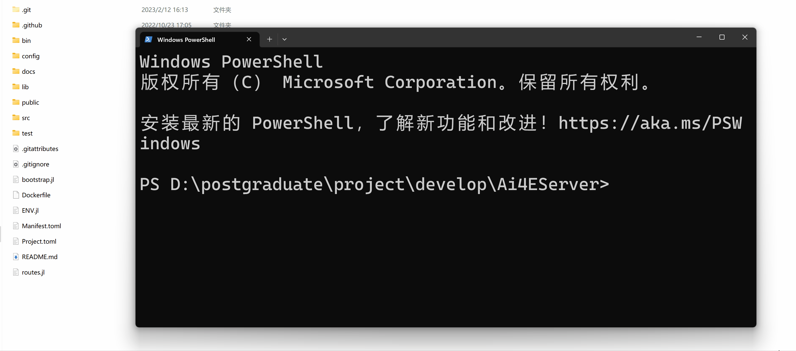

# Ai4ESimulator

## 简介

高可拓展的云架构流程系统仿真平台基于新一代开源科学计算编程语言Julia与Vue3前端框架，适用于复杂流程系统的云仿真平台。云仿真平台采用前后端分离技术:前端为Web界面;后端为集解析器、组件库、求解器三大模块为一体的仿引擎，各模块间通过接口协同工作。仿真平台具备高度可拓展性，后端参析器可嵌入参数辨识问题、优化问题、控制问题等多种问题的代码生成工具;组件库广泛适用于能源、化工、机器、电气等多个领域的流程系统模型。

## 开源技术架构

|模块|链接|内容|
|---|---|---|
|前端|[VUE3](https://cn.vuejs.org/)|渐进式JavaScript 框架|
|前端|[Soybean-admin](https://github.com/honghuangdc/soybean-admin)|基于NaiveUI的中后台模版|
|后端|[OptControl.jl](https://ai4energy.github.io/OptControl.jl/dev/)|最优控制拓展包|
|后端|[Ai4EComponentLib.jl](https://ai4energy.github.io/Ai4EComponentLib.jl/dev/)|组件库|
|后端|[Ai4EMetaPSE.jl](https://ai4energy.github.io/Ai4EMetaPSE.jl/dev/)|解析器|
|后端|[Ai4Server](https://ai4energy.github.io/Ai4EServer/)|后端服务框架|
|后端|[ModelingToolkit.jl](https://github.com/SciML/ModelingToolkit.jl)|组件建模工具包|
|后端|[DifferentialEquations.jl](https://github.com/SciML/DifferentialEquations.jl)|微分方程求解引擎|
|文档|[Ai4EDocs](https://ai4energy.github.io/Ai4EDocs/dev/)|教程文档、设计文档|
|组织|[Ai4Energy](https://github.com/ai4energy)|开源组织主页|


## 系统展示


## 案例展示

* [热力循环](examples/Exam_ThermodynamicCycle.md)
* [空气管道](examples/Exam_AirPipeSim.md)
* [锂电池](examples/Exam_Li_battery.md)
* [电解槽](examples/Exam_PEMElectrolyzer.md)
* [水力管网](examples/Exam_IncompressiblePipe.md)

## Quick Start

### 本地开启后端服务

切换到项目文件夹



### 本地开启前端服务

切换到项目文件夹，安装依赖

```sh
npm install
```

开启服务

```sh
npm run dev
```

## 欢迎加入

指导老师：李明涛（mingtao@mail.xjtu.edu.cn）

鸣谢：

|年份|贡献者|
|---|---|
|2023——第34届腾飞杯||
|2024——第35届腾飞杯|期待你的加入！|
|2025......|......|
